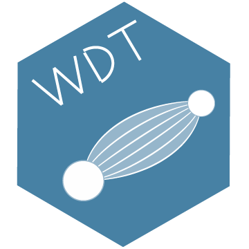

`WDT` Warp speed Data Transfer
------------------------------

[](https://gitter.im/facebook/wdt?utm_source=badge&utm_medium=badge&utm_campaign=pr-badge&utm_content=badge)

[](https://travis-ci.org/facebook/wdt)

## Design philosophy/Overview

Goal:
Lowest possible total transfer time -  to be only hardware limited
(disc or network bandwidth not latency) and as efficient as possible
(low CPU/memory/resources utilization)

We keep dependencies minimal in order to maximize portability
and ensure a small binary size. As a bonus, this also minimizes compile time.

We aren't using exceptions for performance reasons and because using exceptions
would make it harder to reason about the control flow of the library.
We also believe the WDT library is easier to integrate as a result.
Our philosophy is to write moderately structured and encapsulated C code
as opposed to using every feature of C++.

We try to minimize the number of system calls, which is one of the reasons
we are using blocking thread IOs. We can maximize system throughput because
at any given point some threads are reading while others are writing, and data
is buffered on both paths - keeping each subsystem busy while minimizing
kernel to userspace switches.

## Terminology
WDT uses "Mbytes" everywhere in its output as 1024*1024 bytes = 1048576 bytes
(technically this should be the new mebibyte (MiB) standard but it felt
Mbytes is be more in line with what other tools are using, clearer, easier
to read and matching what a traditional "megabyte" used to mean in historical
memory units where the address lines are binary and thus power of two and not
of ten)

## Example

While WDT is primarily a library, we also have a small command line tool
which we use for tests and which is useful by itself. Here is a quick example:

```
Receiver side: (starts the server indicating destination directory)

[ldemailly@devbig074]$ wdt -directory /data/users/ldemailly/transfer1

Sender side: (discover and sends all files in a directory tree to destination)

[root@dev443]$ wdt -directory /usr/bin -destination devbig074.prn2

[=================================================] 100% 588.8 Mbytes/s
I0720 21:48:08.446014 3245296 Sender.cpp:314] Total sender time = 2.68699
seconds (0.00640992 dirTime). Transfer summary : Transfer status = OK. Number
of files transferred = 1887. Data Mbytes = 1582.08. Header Kbytes = 62.083
(0.00383215% overhead). Total bytes = 1658999858. Wasted bytes due to
failure = 0 (0% overhead). Total sender throughput = 588.816 Mbytes/sec
(590.224 Mbytes/sec pure transf rate)
```

Note that in this simple example with lots of small files (/usr/bin from
a linux distribution), but not much data (~1.5Gbyte), the maximum
speed isn't as good as it would with more data (as there is still a TCP ramp
up time even though it's faster because of parallelization) like when we use
it in our production use cases.

## Performance/Results

In an internal use at Facebook to transfer RocksDB snapshot between hosts
we are able to transfer data at a throttled 600 Mbytes/sec even across
long distance, high latency links (e.g. Sweden to Oregon). That's 3x the speed
of the previous highly optimized HTTP-based solution and with less strain on the
system. When not throttling, we are able to easily saturate a 40 Gbit/s NIC and
get near theoretical link speed (above 4 Gbytes/sec).

We have so far optimized WDT for servers with fast IOs - in particular flash
card or in-memory read/writes. If you use disks throughput won't be as good,
but we do plan on optimizing for disks as well in the future.

## Dependencies

CMake for building WDT - See [build/BUILD.md](build/BUILD.md)

gflags (google flags library) but only for the command line,  the library
doesn't depend on that

gtest (google testing) but only for tests

glog (google logging library) - use W*LOG macros so everything logged by WDT
is always prefixed by "wdt>" which helps when embedded in another service

Parts of Facebook's Folly open source library (as set in the CMakefile)
Mostly conv, threadlocal and checksum support.

For encryption, the crypto lib part of openssl-1.x

You can build and embed wdt as a library with as little as a C++11 compiler
and glog - and you could macro away glog or replace it by printing to stderr if
needed.

## Code layout

### Directories

* top level
Main WDT classes and Wdt command line source, CMakeLists.txt

* util/
Utilities used for implementing the main objects

* test/
Tests files and scripts

* build/
Build related scripts and files and utils


* fbonly/
Stuff specific to facebook/ (not in open source version)

* bench/
Benchmark generation tools


### Main files

* CMakeLists.txt, .travis.yml, build/BUILD.md,travis_linux.sh,travis_osx.sh
Build definition file - use CMake to generate a Makefile or a project file for
your favorite IDE - details in [build/BUILD.md](build/BUILD.md)

* wdtCmdline.cpp

Main program which allows to have a server or client process to exercise
the library (for end 2 end test as well as a standalone utility)

* wcp.sh

A script to use wdt like scp for single big files - pending splitting support
inside wdt proper the script does the splitting for you. install as "wcp".

* WdtOptions.{h|cpp}

To specify the behavior of wdt. If wdt is used as a library, then the
caller get the mutable object of options and set different options accordingly.
When wdt is run in a standalone mode, behavior is changed through gflags in
wdtCmdLine.cpp

* WdtThread.{h|cpp}
Common functionality and settings between SenderThread and ReceiverThread.
Both of these kind of threads inherit from this base class.

* WdtBase.{h|cpp}

Common functionality and settings between Sender and Receiver

* WdtResourceController.{h|cpp}

Optional factory for Sender/Receiver with limit on number being created.

### Producing/Sending

* ByteSource.h

Interface for a data element to be sent/transferred

* FileByteSource.{h|cpp}

Implementation/concrete subclass of ByteSource for a file identified as a
relative path from a root dir. The identifier (path) sent remotely is
the relative path

* SourceQueue.h

Interface for producing next ByteSource to be sent

* DirectorySourceQueue.{h|cpp}

Concrete implementation of SourceQueue producing all the files in a given
directory, sorted by decreasing size (as they are discovered, you can start
pulling from the queue even before all the files are found, it will return
the current largest file)

* ThreadTransferHistory.{h|cpp}

Every thread maintains a transfer history so that when a connection breaks
it can talk to the receiver to find out up to where in the history has been
sent. This class encapsulates all the logic for that bookkeeping

* SenderThread.{h|cpp}

Implements the functionality of one sender thread, which binds to a certain port
and sends files over.

* Sender.{h|cpp}

Spawns multiple SenderThread threads and sends the data across to receiver

### Consuming / Receiving

* FileCreator.{h|cpp}

Creates file and directories necessary for said file (mkdir -p like)

* ReceiverThread.{h|cpp}

Implements the funcionality of the receiver threads, responsible for listening on
a port and receiving files over the network.

* Receiver.{h|cpp}

Parent receiver class that spawns multiple ReceiverThread threads and receives
data from a remote host

### Low level building blocks

* ServerSocket.{h|.cpp}

Encapsulate a server socket listening on a port and giving a file descriptor
to be used to communicate with the client

* ClientSocket.{h|cpp}

Client socket wrapper - connection to a server port -> fd

* Protocol.{h|cpp}

Decodes/Encodes meta information needed to interpret the data stream:
the id (file path) and size (byte length of the data)

* SocketUtils.{h|cpp}

Common socket related utilities (both client/server, sender/receiver side use)

* Throttler.{h|cpp}

Throttling code

* ErrorCodes.h

Header file for error codes

* Reporting.{h|cpp}

Class representing transfer stats and reports

## Future development/extensibility

The current implementation works well and has high efficiency.
It is also extensible by implementing different byte sources both in and
out. But inserting processing units isn't as easy.

For that we plan on restructuring the code to use a Zero copy stream/buffer
pipeline: To maintain efficiency, the best overall total transfer time and
time to first byte we can see WDT's internal architecture as chainable units

[Disk/flash/Storage IO] -> [Compression] -> [Protocol handling]
-> [Encryption] -> [Network IO]

And the reverse chain on the receiving/writing end
The trick is the data is variable length input and some units can change length
and we need to process things by blocks
Constraints/Design:
- No locking / contention when possible
- (Hard) Limits on memory used
- Minimal number of copies/moving memory around
- Still works the same for simple
   read file fd -> control -> write socked fd current basic implementation

Possible Solution(?) API:
- Double linked list of Units
- read/pull from left (pull() ?)
- push to the right (push() ?)
- end of stream from left
- propagate last bytes to right

Can still be fully synchronous / blocking, works thanks to eof handling
(synchronous gives us lock free/single thread - internally a unit is
free to use parallelization like the compression stage is likely to want/need)

Another thing we touched on is processing chunks out of order - by changing
header to be ( fileid, offset, size ) instead of ( filename, size )
and assuming everything is following in 1 continuous block (will also help
the use case of small number of large files/chunks) : mmap'in
the target/destination file
The issue then is who creates it in what order - similar to the directory
creation problem - we could use a meta info channel to avoid locking/contention
but that requires synchronization

We want things to work with even up to 1 second latency without incurring
a 1 second delay before we send the first payload byte


## Submitting diffs/making changes

See CONTRIBUTING.md

Please run the tests
```
CTEST_OUTPUT_ON_FAILURE=1 make test
```
And ideally also the manual tests (integration/porting upcoming)

wdt_e2e_test.sh
wdt_download_resumption_test.sh
wdt_network_test.sh
wdt_max_send_test.sh

(facebook only:)
Make sure to do the following, before "arc diff":
```
 (cd wdt ; ./build/clangformat.sh )
 # if you changed the minor version of the protocol (in CMakeLists.txt)
 # run (cd wdt ; ./build/version_update.tcl ) to sync with fbcode's WdtConfig.h

 fbconfig  --clang --sanitize=address -r  wdt

 fbmake runtests --run-disabled --extended-tests
 # Optionally: opt build
 fbmake runtests_opt
 fbmake opt
 # Sender max speed test
 wdt/test/wdt_max_send_test.sh
 # Check buck build
 buck build wdt/...
 # Debug a specific test with full output even on success:
 buck test wdt:xxx -- --run-disabled --extended-tests --print-passing-details\
   --print-long-results
```

and check the output of the last step to make sure one of the 3 runs is
still above 20,000 Mbytes/sec (you may need to make sure you
/dev/shm is mostly empty to get the best memory throughput, as well
as not having a ton of random processes running during the test)

Also :

* Update this file
* Make sure your diff has a task
* Put (relevant) log output of sender/receiver in the diff test plan or comment
* Depending on the changes
  * Perf: wdt/wdt_e2e_test.sh has a mix of ~ > 700 files, > 8 Gbytes/sec
  * do run remote network tests (wdt/wdt_remote_test.sh)
  * do run profiler and check profile results (wdt/fbonly/wdt_prof.sh)
    80k small files at > 1.6 Gbyte/sec
